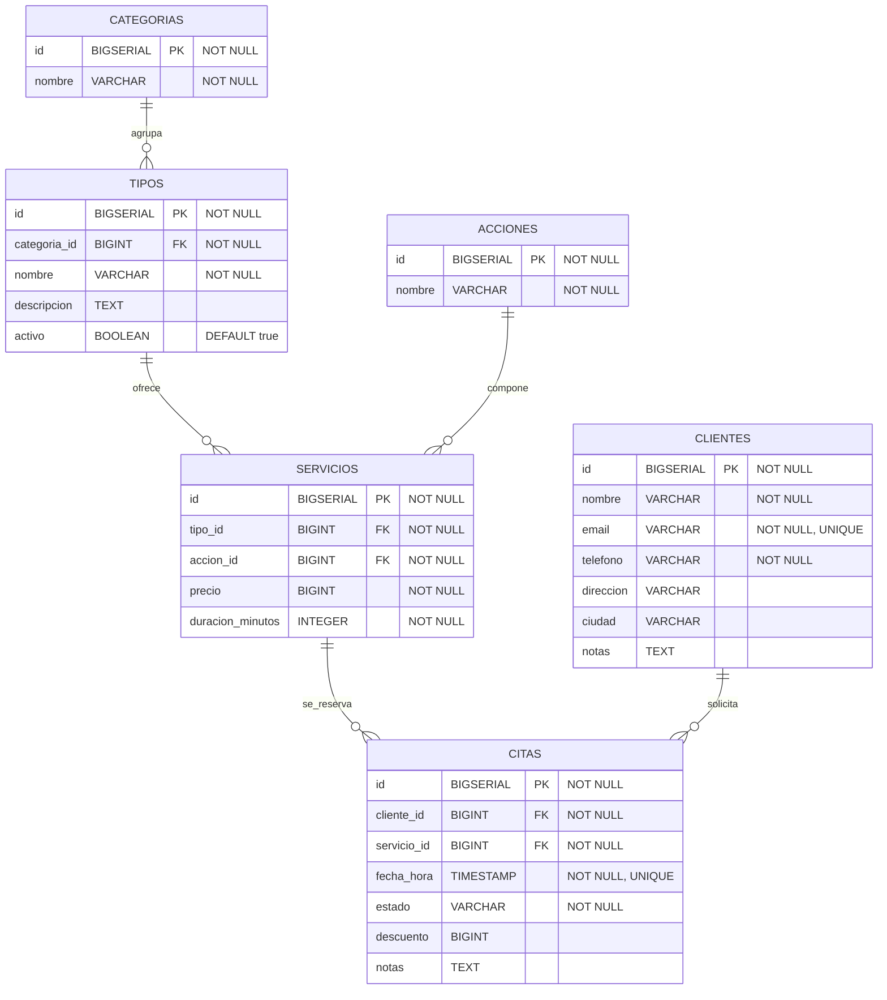

# 💇 Back Smart Beauty Manager

## 📋 Requisitos por opción de ejecución

| Herramienta | Opción 1<br>(Local) | Opción 2<br>(Híbrido) | Opción 3<br>(Docker) |
|---|---------|----------|----------|
| ☕ Java 21 | ✅ | ✅ | ❌ |
| 🗄️ PostgreSQL | ✅ | ❌ | ❌ |
| 🐳 Docker | ❌ | ✅ | ✅ |

**Links de descargas:** [Java 21](https://jdk.java.net/archive/) • [PostgreSQL](https://www.postgresql.org/download/) • [Docker](https://www.docker.com/products/docker-desktop)

---

## 🚀 Cómo ejecutar el backend

### 🖥️ Opción 1: Local (Back y BD en local)

Necesitas Java 21 y PostgreSQL instalado localmente.

**1️⃣ Crear esquema e insertar datos:**
```bash
# Desde psql o cualquier cliente SQL
psql -U postgres -d db_smart_beauty_manager -f sql/01-schema.sql
psql -U postgres -d db_smart_beauty_manager -f sql/02-seed.sql
```

**2️⃣ Cambiar puerto BD en src/main/resources/application.yml:**

Cambiar esta línea (reemplaza `5431` con el puerto de tu PostgreSQL local, por defecto es `5432`):

```yaml
# ANTES
spring.datasource.url: jdbc:postgresql://localhost:5431/db_smart_beauty_manager

# DESPUÉS
spring.datasource.url: jdbc:postgresql://localhost:5432/db_smart_beauty_manager
```

**3️⃣ Ejecutar el backend:**
```bash
./mvnw spring-boot:run
```

✅ Back: `http://localhost:8080`

---

### 🖥️🐳 Opción 2: Híbrido (Back en local y BD en Docker)

Necesitas Java 21 y Docker instalado localmente.

```bash
docker compose up -d postgres
./mvnw spring-boot:run
```

✅ Back: `http://localhost:8080`  
🔥 Hot-reload: cambios de código son instantáneos

---

### 🐳 Opción 3: Docker (Back y BD en Docker)

Solo necesitas Docker instalado localmente.

**🚀 Ejecutar:**
```bash
docker compose up -d
```

✅ Back: `http://localhost:8080`


**📝 Después de cambiar código Java (forzar recompilación):**
```bash
docker compose up -d --build
```

**🛠️ Gestión:**
```bash
docker compose logs -f backend    # 📊 Ver logs
docker compose down               # ⛔ Parar
docker compose down -v            # ⛔ Parar y limpiar base de datos
```

---

## 📂 Estructura de carpetas:

```
├── docs/                                                     # Documentación y colecciones
│   └── back-smart-beauty-manager.postman_collection.json     # Colección de Postman
├── sql/                                                      # Scripts de inicialización de BD
│   ├── 01-schema.sql                                         # DDL (creación de tablas)
│   └── 02-seed.sql                                           # DML (datos de ejemplo)
├── src/
│   ├── main/
│   │   ├── java/com/back/sbm/
│   │   │   ├── model/
│   │   │   │   ├── entities/                                 # Entidades JPA (Cliente, Servicio, Cita)
│   │   │   │   └── repositories/                             # Interfaces Spring Data JPA
│   │   │   ├── services/                                     # Lógica de negocio
│   │   │   │   └── map/                                      # Mappers para transformación de DTOs
│   │   │   ├── controllers/                                  # Endpoints REST
│   │   │   │   └── dto/                                      # Objetos de transferencia de datos
│   │   │   └── exception/                                    # Manejador global de excepciones
│   │   └── resources/
│   │       └── application.yml                               # Configuración de Spring
│   └── test/                                                 # Pruebas unitarias
├── docker-compose.yml                                        # Orquestación: backend + PostgreSQL
├── Dockerfile                                                # Multi-stage: compilar y ejecutar backend
├── pom.xml                                                   # Dependencias Maven
└── mvnw / mvnw.cmd                                           # Maven Wrapper
```
---

## 🔌 Endpoints API

### 👥 Clientes
- **GET** `/clientes` - Obtener todos los clientes
- **GET** `/clientes/{id}` - Obtener un cliente por ID  
- **POST** `/clientes` - Crear un cliente
- **PUT** `/clientes/{id}` - Actualizar un cliente
- **DELETE** `/clientes/{id}` - Eliminar un cliente

### 📂 Categorías
- **GET** `/categorias` - Obtener todas las categorías
- **GET** `/categorias/{id}` - Obtener una categoría por ID
- **POST** `/categorias` - Crear una categoría
- **PUT** `/categorias/{id}` - Actualizar una categoría
- **DELETE** `/categorias/{id}` - Eliminar una categoría

### 🏷️ Tipos
- **GET** `/tipos` - Obtener todos los tipos
- **GET** `/tipos/{id}` - Obtener un tipo por ID
- **POST** `/tipos` - Crear un tipo (requiere `categoriaId`)
- **PUT** `/tipos/{id}` - Actualizar un tipo
- **DELETE** `/tipos/{id}` - Eliminar un tipo

### ⚡ Acciones
- **GET** `/acciones` - Obtener todas las acciones
- **GET** `/acciones/{id}` - Obtener una acción por ID
- **POST** `/acciones` - Crear una acción
- **PUT** `/acciones/{id}` - Actualizar una acción
- **DELETE** `/acciones/{id}` - Eliminar una acción

### 💇 Servicios
- **GET** `/servicios` - Obtener todos los servicios
- **GET** `/servicios/{id}` - Obtener un servicio por ID
- **POST** `/servicios` - Crear un servicio (requiere `tipoId` y `accionId`)
- **PUT** `/servicios/{id}` - Actualizar un servicio
- **DELETE** `/servicios/{id}` - Eliminar un servicio

### 📅 Citas
- **GET** `/citas` - Obtener todas las citas
- **GET** `/citas/{id}` - Obtener una cita por ID
- **POST** `/citas` - Crear una cita (requiere `clienteId` y `servicioId`)
- **PUT** `/citas/{id}` - Actualizar una cita
- **DELETE** `/citas/{id}` - Eliminar una cita

---

## 📬 Postman

La colección de Postman está en `docs/back-smart-beauty-manager.postman_collection.json`

**Características:**
- 📌 30 requests: 5 (CRUD) por cada uno de los 6 recursos
- 🔌 Variable de entorno: `url_base` (por defecto: `localhost:8080`)

**Para importar:**
1. Abre Postman
2. Click en "Import" → selecciona `back-smart-beauty-manager.postman_collection.json`
3. Verifica que la variable `url_base` esté configurada correctamente
4. ¡Comienza a realizar peticiones! 🚀

---

## 🏗️ Estructura BD

### Diagrama de relaciones:


## Tablas:
| Tabla | Descripción |
|-------|-------------|
| `clientes` | Información de clientes |
| `categorias` | Categorías de servicios |
| `tipos` | Tipos dentro de una categoría |
| `acciones` | Acciones a realizar |
| `servicios` | Combinación de tipo + acción + precio + duración |
| `citas` | Reservas de clientes para servicios |

